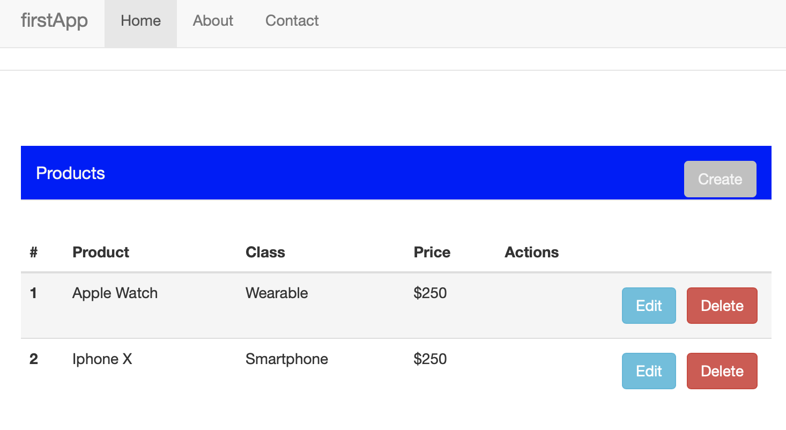

# CRUD Project

You are going to do a CRUD project to meet this requirement this project must have:

1. List of products with the following information:
    * Product Name: _ e.g Apple Watch S3 _
    * Category: _ e.g Wearables _
    * Price: _ e.g $450 _
    * Actions:
        * Delete
        * Edit
2. A button to create products
3. When the user clicks on edit button a modal should be shown, and the user could be edit the product info as product name, category and price.

## How to run
This project is ready to play, to do that you need to have the below apps installed.

### Pre-requisites
This project uses a generator, basically this generator is a magic box that makes its trick and creates the skeleton for you. That includes, scaffolding, test, automatized task, other.
One of the most populars is Yeoman.

Do you already have ``npm``? No? follow the next guide to install it:
[Installing npm packages locally](https://docs.npmjs.com/getting-started/installing-npm-packages-locally)
Are you ready? well, we need to install some dependencies:

`npm install -g grunt-cli bower yo generator-karma generator-angular`

Do you know what is SASS? Well, if you want to work with that you need to install some additional dependencies:
- Install Ruby by downloading from [here](http://rubyinstaller.org/downloads/) or use Homebrew
- Install compass gem
`gem install compass`

We perform the bellow steps for you before that:

* Run yo angular - `yo angular [app-name]` e.x. `yo angular crud-project`
Some questions that you need to answer:
    * Would you like to use Gulp (experimental) instead of Grunt? No
    * Would you like to use Sass (with Compass)? No
    * Would you like to include Bootstrap? Yes
    * Would you like to use the Sass version of Bootstrap? Yes
    * Which modules would you like to include? No modify the preselected items.
    * Overwrite README.md? Yes.
    * Overwrite package.json? Yes
    * One Warning by vulnerabilities could be thrown, to fix it, you need to run it `npm audit fix --force`
    * One error related to connect.static was fixed on Gruntfile.js, adding `var serveStatic = require('serve-static');` and replacing `connect.static` with `servestatic`
* When the previous step has finished, you need to run the app with `grunt`, for build you need to run this command: `grunt serve`
* Now you have a skeleton running.

This is an example:

